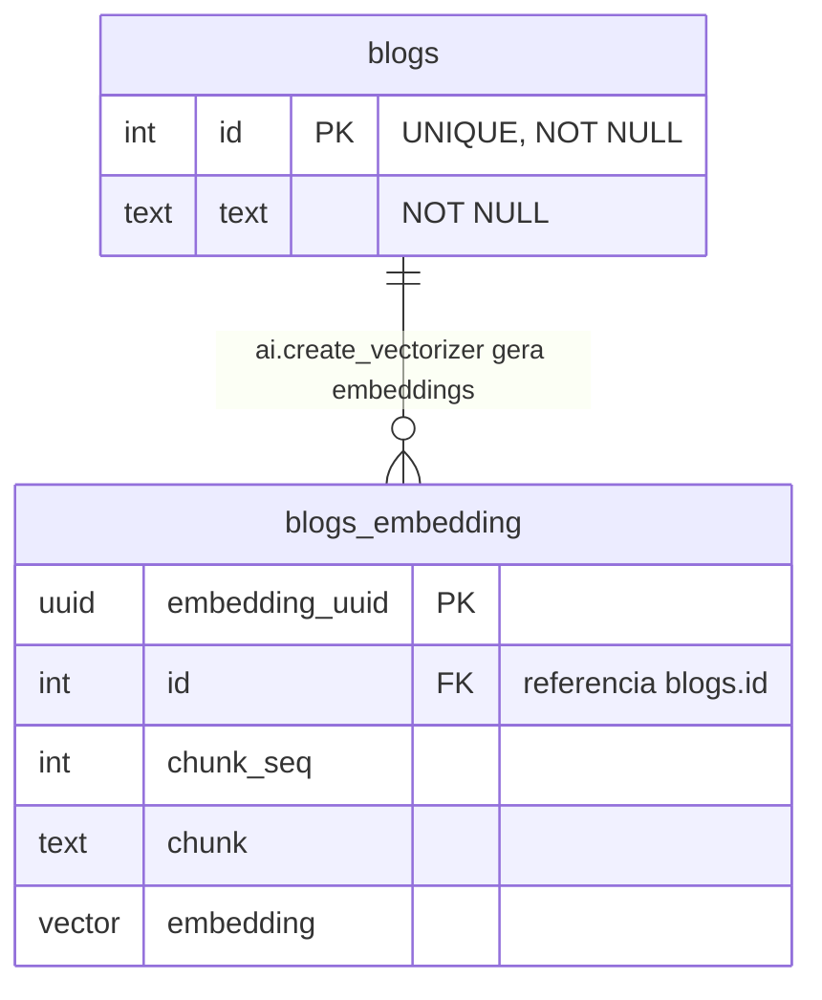

# Produto: Extensão de IA para PostgreSQL

## Objetivo

Ferramenta inspirada no PGAI que facilita a implementação de RAG (Retrieval-Augmented Generation), vetorização e embeddings diretamente no PostgreSQL, usando modelos open source/locais (ex.: Ollama) ou OpenAI.

O PGAI foi arquivado e não recebe mais manutenção; suas funções em Python dentro do Postgres tornaram tutoriais e documentações obsoletas. Este produto substitui esse fluxo com soluções atualizadas e funcionais, reduzindo o código necessário para criar e manter tabelas vetorizadas.

## Personas

- **Ex-usuários do PGAI:** precisam migrar seus fluxos de tabelas vetorizadas e RAG para uma alternativa mantida.
- **Usuários prejudicados por documentação desatualizada do PGAI:** aprendizes que buscam ferramentas atualizadas que funcionem como documentado.
- **AI engineers:** desenvolvedores que implementam RAG, vetorização e embeddings e buscam facilidade de integração.

## Funcionalidades principais

### Instalação da extensão
Instalável no PostgreSQL ou em imagem Docker. Após instalada, expõe funções prontas no schema `ai` para reduzir código repetitivo (ex.: montar uma `rag_generation_function` reutilizando funções da extensão).

### Vetorização automática de tabelas
`ai.create_vectorizer` monitora uma tabela de origem e gera embeddings automaticamente para cada registro inserido, gravando em uma tabela de destino via vectorizers e workers.

```sql
CREATE TABLE blogs(
    id INT PRIMARY KEY,
    text TEXT NOT NULL
);

SELECT ai.create_vectorizer(
    'blogs'::regclass,
    destination => 'blogs_embedding'
    -- embedding e chunking configurados aqui
);
```

A tabela de destino (`<origem>_embedding`) segue o padrão: `embedding_uuid` (PK), FK para a origem, `chunk_seq`, `chunk` (texto) e `embedding` (vector).



### Uso de modelos
Funções dedicadas por provedor/modelo para embeddings e vetorização. Cada provedor com implementação tem sua própria chamada:

```sql
ai.ollama_embedding(model='')
ai.ollama_vectorizer(model='', dimension='')

ai.openai_embedding(model='')
ai.openai_vectorizer(model='', dimension='')
```

## Convenções ao trabalhar neste código

- **Schema `ai`:** todas as funções públicas da extensão são expostas sob o schema `ai` (ex.: `ai.create_vectorizer`).
- **Nomenclatura de funções de modelo:** siga o padrão `ai.<provedor>_<operação>` (ex.: `ollama_embedding`, `openai_vectorizer`).
- **Tabelas de destino:** derive o nome a partir da origem com sufixo `_embedding` e mantenha o esquema de colunas padrão acima.
- **Simplicidade acima de completude:** prefira a API mais simples que resolva o caso de uso a soluções genéricas e complexas.
- **Idioma:** documentação, mensagens e comentários em português do Brasil claro.
- **Licença:** respeitar a licença MIT open source em todas as contribuições.

## Objetivos de negócio (O) e métricas de sucesso (M)

- Reduzir a complexidade de implementar RAG e vetorização no PostgreSQL. (O)
- Oferecer uma ferramenta para uso de IA diretamente no PostgreSQL. (O)
- Tempo de execução em benchmark próximo ou superior ao do PGAI. (M)
- Menor tempo e complexidade de implementação de RAG que a abordagem manual. (M)
- Menor tempo e complexidade de implementação de buscas semânticas que a abordagem manual. (M)

##